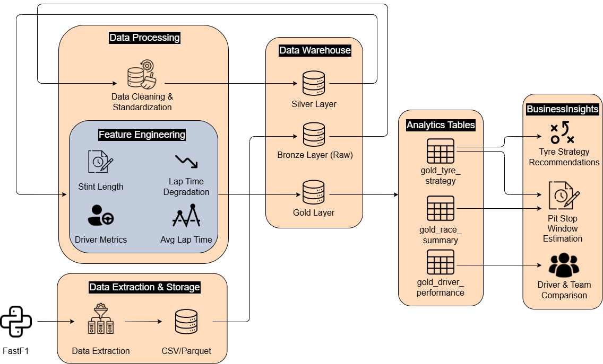

# F1 Tyre Strategy Pipeline

## Overview
This project builds an end-to-end data pipeline using Snowflake to analyze Formula 1 tyre strategy and race performance.  
It transforms raw lap-level telemetry data into analytics-ready datasets to support pre-race strategic decision-making.

The pipeline is designed with a Medallion Architecture (Bronze, Silver, Gold) and supports multi-race and multi-season analysis.

---

## Problem Statement
Formula 1 teams must make critical race strategy decisions such as tyre selection and pit stop timing under uncertainty.

Raw race data alone is not sufficient for decision-making. It must be cleaned, transformed, and aggregated into meaningful metrics.

This project simulates the role of a race strategy analytics team by building a data pipeline that:
- Collects race data
- Transforms it into structured layers
- Generates insights to support strategic planning

---

## Architecture

---

## Data Source
- FastF1 (Python library)
  - Lap times
  - Tyre compounds
  - Stints
  - Driver and session data

---

## Data Pipeline (Medallion Architecture)

### Bronze Layer (Raw)
- Stores raw data extracted from FastF1
- Includes metadata:
  - race year
  - grand prix
  - session type
- Minimal transformation

### Silver Layer (Cleaned & Structured)
- Cleans and standardizes data
- Removes invalid or null values
- Ensures correct data types
- Prepares data for aggregation

### Gold Layer (Analytics)
- Aggregated and feature-engineered tables:
  - f1_tyre_strategy
  - f1_driver_performance
  - f1_race_summary
- Optimized for analysis and decision-making

---

## Pipeline Capabilities

### Parameterized Data Extraction
Supports dynamic extraction by:
- year
- grand prix
- session type

Example:
python src/extract/fastf1_extractor.py --year 2023 --gp Monaco --session R

### Multi-Race Processing
Batch extraction supported:

python src/pipeline/batch_extract.py

### Data Validation Checks
Validation is applied at multiple layers:

Bronze:
- Null checks
- Duplicate detection
- Invalid values

Silver:
- Data type validation
- Value range checks

Gold:
- Aggregation consistency checks

---

## Key Outputs

### 1. Tyre Strategy Analysis
- Stint length per compound
- Average lap time per compound
- Performance degradation

### 2. Driver Performance
- Average lap time
- Best and worst lap
- Consistency (standard deviation)

### 3. Race Summary
- Performance comparison across tyre compounds

---

## Example Insights
- Soft tyres degrade faster after several laps  
- Medium tyres provide more consistent performance  
- Certain drivers maintain stable pace across longer stints  

---

## Project Structure

f1-tyre-strategy-pipeline/
├─ docs/
├─ data/
├─ src/
├─ sql/
└─ README.md

---

## How to Run

1. Install dependencies
pip install -r requirements.txt

2. Extract data
python src/extract/fastf1_extractor.py --year 2023 --gp Monaco --session R

3. Load data into Snowflake

4. Run SQL pipeline

5. Run validation

6. Run analysis queries

---

## Tech Stack
- Python (FastF1, Pandas)
- Snowflake (Data Warehouse)
- SQL
- GitHub

---

## Future Improvements
- CI/CD with GitHub Actions
- Incremental pipeline
- Weather data integration
