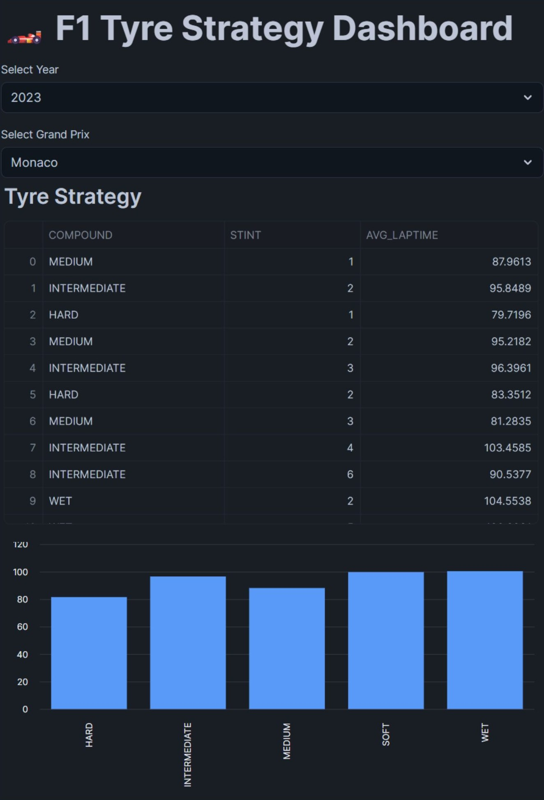
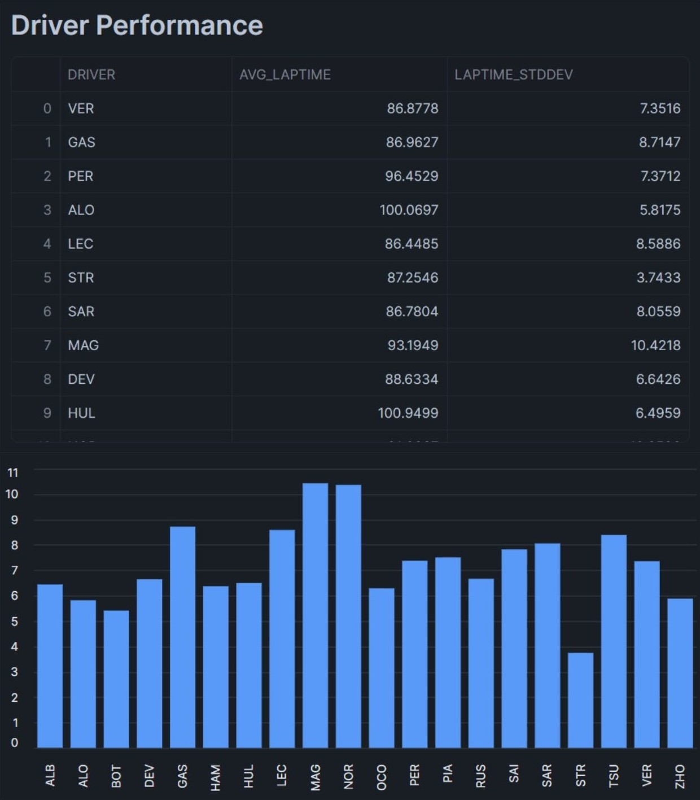

# 🏎️ F1 Tyre Strategy Pipeline

## Overview

This project builds an end-to-end data pipeline to analyze Formula 1
tyre strategy and driver performance using Snowflake and dbt.

It transforms raw lap-level telemetry data from FastF1 into
analytics-ready datasets and presents insights through an interactive
dashboard.

------------------------------------------------------------------------

## Problem Statement

Formula 1 teams must make critical decisions such as tyre selection and
pit stop timing under uncertainty.

Raw lap data alone is not sufficient. It must be transformed into
meaningful metrics such as: - Tyre performance by compound - Driver
consistency - Stint-level behavior

This project simulates a race strategy analytics pipeline that converts
raw data into actionable insights.

------------------------------------------------------------------------

## Architecture

------------------------------------------------------------------------

## Pipeline Flow

FastF1 (Python Extraction)\
→ Raw CSV\
→ Snowflake Bronze\
→ dbt (Silver → Gold)\
→ Data Tests\
→ Analytics Output (Dashboard)

------------------------------------------------------------------------

## Dashboard (Streamlit)

📂 Location: `sample-uses/dashboard/`

Features:
- Filter by race year and Grand Prix
- Compare tyre performance
- Analyze driver consistency

### Preview

------------------------------------------------------------------------

## Tech Stack

-   Python (FastF1, Pandas)
-   Snowflake
-   dbt
-   SQL
-   Streamlit

------------------------------------------------------------------------

## Data Source

This project uses data from:

- [FastF1](https://github.com/theOehrly/Fast-F1) — a Python library for accessing Formula 1 telemetry and timing data

------------------------------------------------------------------------

## Disclaimer

This project is for educational purposes and is not affiliated with Formula 1 or any official teams.

------------------------------------------------------------------------

## Future Improvements

-   Incremental pipeline
-   Multi-race ingestion
-   Tyre degradation modeling
-   Strategy recommendation engine
